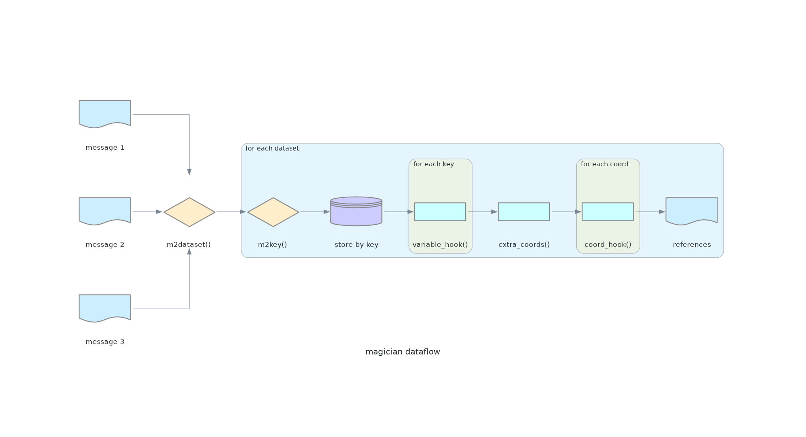

# gribscan Magicians

The dataset building process in gribscan is based on the idea, that each GRIB message should be
placed somewhere into an imaginary multi-dimensional shelf, which is spanned by datasets, variables
and coordinates. The Magician is a tool to customize the decisions required within that flow from grib messages to datasets.
To do so, there are a couple of methods which can be implemented and hook into the flow:



## properties

### dimkeys
`dimkeys` must be a tuple including all dimension names corresponding to the `dimension_key` return value of `m2key`.

## methods

### m2dataset
```python
def m2dataset(self, meta):
    return dataset_name
```

`m2dataset` is run once per GRIB message and must determine into which dataset the message will go. The `meta` input is the full information from the grib index.
Everything after is treated separately for each dataset.

### m2key

```python
def m2key(self, meta):
    return variable_key, dimension_key
```

`m2key` is run once per GRIB message in each dataset. It must return a two-element `tuple`, where the first is used to determine in which variable the message will end up and the second 

### variable_hook

```python
def variable_hook(self, key, info):
    return {}
```

After grouping all the messages by `key`, `variable_hook` is called once per unique `variable_key`.
It can be used to update the `info`-dict containing information about the variables' name, shape, dimensions, attributes etc...
The `info`-dict passed into this method will contain the following keys:

* `dims`: tuple containing dimension names across GRIB messages (i.e. `dimkeys`, but unit-sized dimensions are skipped)
* `shape`: shape across GRIB messages
* `dim_id`: tuple with indices into the original `dimkeys`
* `coords`: tuple of iterables containing all discovered coordinate values along each dimension
* `data_shape`: list of shape within a GRIB message
* `data_dims`: list of dimension names within a GRIB message
* `dtype`: (numpy-) datatype of the values
* `attrs`: attributes for the variable,
* `extra`: extra properties from the GRIB index file

Everything returned by this method will be merged back into the initial `info` passed into the method.

### extra_coords

```python
def extra_coords(self, varinfo):
    return {"coord_name": [1,2,3,4]}
```

The argument of `extra_coords` is a dictionary from `key` to (updated) `info` for all variables.
It must return a dictionary, which may contain additional coordinates to the dataset.
The values must be numpy-like arrays.

### coords_hook

```python
def coords_hook(self, name, coords):
    return attrs, coords, array_meta
```

`coords_hook` will be called once per output coordinates (both, automatically generated and extra).
Arguments are the `name` and the coordinate values (i.e. as would be returned by `extra_coords`).
It must return a tuple consisting of an attributes dict, the (maybe modified) coordinate values and a dict containing metadata to be merged into the `.zattrs` dictionary of the final zarr.

### globals_hook

```python
def globals_hook(self, global_attrs):
    return global_attrs
```

`globals_hook` can be used to modify global attributes of the final dataset.
